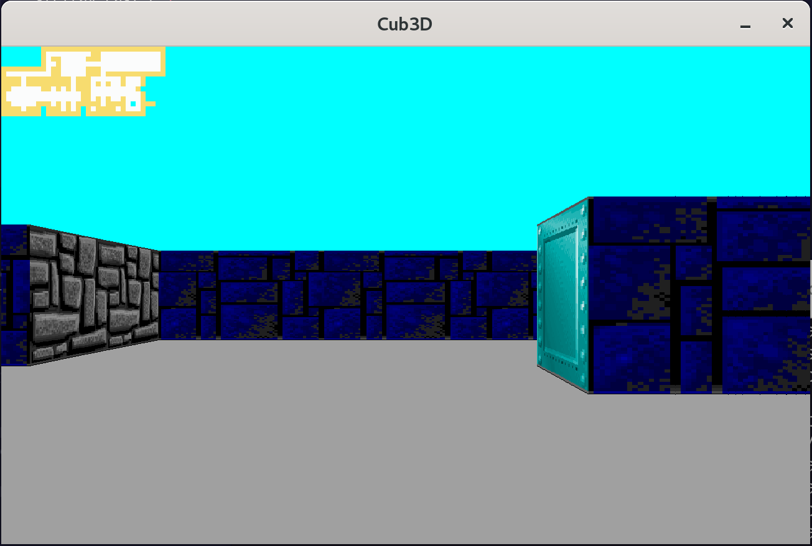

# 🎮 Cub3D

Cub3D is a 3D maze exploration game inspired by Wolfenstein 3D.  
Navigate through mazes, explore your surroundings, and reach the exit while enjoying a 3D perspective generated from a 2D map.

## 🧩 How It Works

The game reads a `.cub` map file, which defines:

- Walls (`1`)  
- Empty spaces (`0`)  
- Player starting position (`P`)  
- Optional collectibles or objects (`C`)  
- Exit (`E`)  

Using raycasting, the 2D map is rendered in a 3D view. The player can move freely inside the map while the camera adjusts the perspective in real time.

## 🎮 Controls

| Key | Action |
|-----|--------|
| `W` | Move forward |
| `S` | Move backward |
| `A` | Strafe left |
| `D` | Strafe right |
| `←` | Rotate camera left |
| `→` | Rotate camera right |
| `ESC` | Exit the game |

## 🗺️ Maps

The game supports `.cub` map files. Example:
```
111111111111
1P0000000C01
101111011101
100000000001
101011111101
1C0000000E01
111111111111
```


- `1` – Wall (impassable)  
- `0` – Empty space (walkable)  
- `P` – Player starting point  
- `C` – Collectible item (optional)  
- `E` – Exit  

You can create your own maps by following this format.

## 🎮 How to Play

1. Start the game by running the executable with a map:

```bash
./cub3D maps/map1.cub
```


<br>
2. Move the player using W/A/S/D and rotate the camera with the arrow keys.

[](assets/video1.mp4)

<br>
3. The game prevents walking through walls for a realistic experience.


